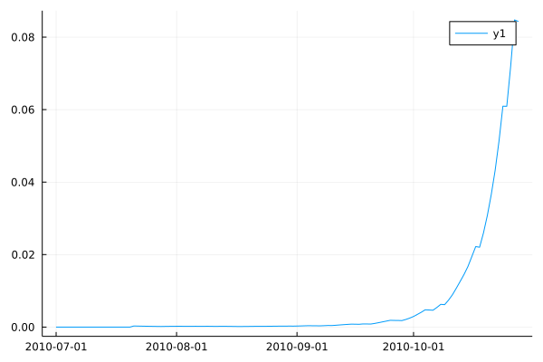

```@meta
Author = "Adam H. Sparks"
```

# Modelling Disease Epidemics

Epicrop supplies one function, `hlipmodel` that can be used to predict unmanaged plant
disease epidemics.
Predefined values for the EPIRICE model can be found in Savary _et al._ (2012) for the
following diseases of rice: bacterial blight, brown spot, leaf blast, sheath blight, tungro.
Given other parameters, the model framework is capable of modelling other diseases using the
methods as described by Savary _et al._ (2012).

```julia
hlipmodel(
    wth,
    emergence,
    onset,
    duration,
    rhlim,
    rainlim,
    H0,
    I0,
    RcA,
    RcT,
    RcOpt,
    p,
    i,
    Sx,
    a,
    RRS,
    RRG)
```
# Keywords
- `wth`: a data frame of weather on a daily time-step.
- `emergence`: expected date of plant emergence entered in `YYYY-MM-DD` format.
From Table 1 Savary *et al.* 2012.
- `onset` expected number of days until the onset of disease after emergence date.
From Table 1 Savary *et al.* 2012.
- `duration`: simulation duration (growing season length).
From Table 1 Savary *et al.* 2012.
- `rhlim`: threshold to decide whether leaves are wet or not (usually 90%).
From Table 1 Savary *et al.* 2012.
- `rainlim`: threshold to decide whether leaves are wet or not.
From Table 1 Savary *et al.* 2012.
- `H0`: initial number of plant's healthy sites.
From Table 1 Savary *et al.* 2012.
- `I0`: initial number of infective sites.
From Table 1 Savary *et al.* 2012.
- `RcA`: crop age modifier for *Rc* (the basic infection rate corrected for removals).
From Table 1 Savary *et al.* 2012.
- `RcT`: temperature modifier for *Rc* (the basic infection rate corrected for removals).
From Table 1 Savary *et al.* 2012.
- `RcOpt`: potential basic infection rate corrected for removals.
From Table 1 Savary *et al.* 2012.
- `i`: duration of infectious period.
From Table 1 Savary *et al.* 2012.
- `p`: duration of latent period.
From Table 1 Savary *et al.* 2012.
- `Sx`: maximum number of sites.
From Table 1 Savary *et al.* 2012.
- `a`: aggregation coefficient.
From Table 1 Savary *et al.* 2012.
- `RRS`: relative rate of physiological senescence.
From Table 1 Savary *et al.* 2012.
- `RRG`: relative rate of growth.
From Table 1 Savary *et al.* 2012.

# Returns
- A `DataFrame` with the model's output.
# Example Usage

Predict an unmanaged epidemic of brown spot at the International Rice Research Institute
(IRRI) Zeigler Experiment station in Los Baños, Calabarzon, Philippines.
Weather data will be downloaded from the [NASA POWER](https://power.larc.nasa.gov) API for
use in this example.
As the model will run for 120 days, we will download weather data for for 120 days starting
on July 01, 2010 and ending on October 28, 2010.
To automate this process, you may find the R package,
[nasapower](https://cran.r-project.org/web/packages/nasapower/index.html), useful for
downloading weather data in conjunction with
[RCall](https://github.com/JuliaInterop/RCall.jl).

```@example
using Epicrop, DataFrames, Dates, CSV, Plots

# download weather data from NASA POWER API
w = CSV.read(download("https://power.larc.nasa.gov/api/temporal/daily/point?parameters=PRECTOTCORR,T2M,RH2M&community=ag&start=20100701&end=20101028&latitude=14.6774&longitude=121.25562&format=csv&time_standard=utc&user=Epicropjl"), DataFrame, header = 12)

# rename the columns to match the expected column names for hlipmodel
rename!(w, :RH2M => :RHUM, :T2M => :TEMP, :PRECTOTCORR => :RAIN)

# add columns for YYYYMMDD and lat/lon
insertcols!(w, 1, :YYYYMMDD => range(Date(2010, 06, 30); step=Day(1), length=120))
insertcols!(w, :LAT => 14.6774, :LON => 121.25562)

RcA = [0 0.35; 20 0.35; 40 0.35; 60 0.47; 80 0.59; 100 0.71; 120 1]

RcT = [15 0; 20 0.06; 25 1.0; 30 0.85; 35 0.16; 40 0]

bs = hlipmodel(
		wth = w,
		emergence = "2010-07-01",
		onset = 20,
		duration = 120,
		rhlim = 90,
		rainlim = 5,
		H0 = 600,
		I0 = 1,
		RcA = RcA,
		RcT = RcT,
		RcOpt = 0.61,
		p = 6,
		i = 19,
		Sx = 100000,
		a = 1,
		RRS = 0.01,
		RRG = 0.1
)

# set GR backend for plots
gr()
plot(bs.dates, bs.intensity)
```



## References

Serge Savary, Andrew Nelson, Laetitia Willocquet, Ireneo Pangga and Jorrel Aunario (2012). Modeling and mapping potential epidemics of rice diseases globally. _Crop Protection_, Volume 34, Pages 6-17, ISSN 0261-2194 DOI: [10.1016/j.cropro.2011.11.009](https://doi.org/10.1016/j.cropro.2011.11.009).